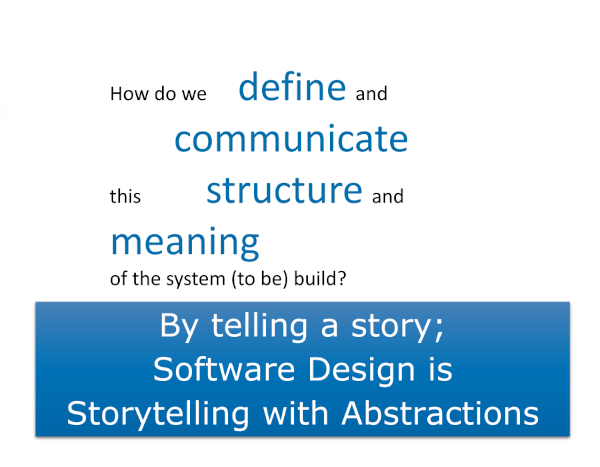

# A Practical Guide to Collaborative Software Design

What is Software Design? Is it “Architecture”? What is “Architecture”?

This repository contains the material for the seminars and workshop "A Practical Guide to Collaborative Software Design" which will answer these questions with as focus the central thesis: 

## Files / references

In this repository you will find the presentation *A Practical Guide to Collaborative Software Design.pdf*.

## PlantUML examples

The examples for the diagrams in the C4 Model can be found in the "src" directory. They are made with a [PlantUML extension](https://github.com/RicardoNiepel/C4-PlantUML). 

Check out [PlantUML](http://plantuml.com/) and how to use it in [Visual Studio Code](https://www.codeproject.com/Articles/1278703/UML-Made-Easy-with-PlantUML-VS-Code).

## License

All resources distributed in this repository are licensed under the conditions as explained in the "license.txt" file. This is the MIT license which can be considered to be Open Source.
